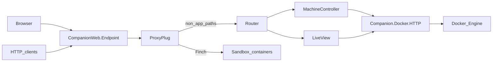

# Architecture (overview)

telvm is a **Phoenix** application (**companion**) that talks to **Docker Engine** over a Unix socket using **Finch**, exposes a **browser UI** (LiveView) and a **JSON + SSE HTTP API** under `/telvm/api`, and **reverse-proxies** HTTP to sandbox containers on the Compose bridge via **`CompanionWeb.ProxyPlug`**.

## Data flow (simplified)

## Main components

| Area | Role |
|------|------|
| [`companion/lib/companion_web/endpoint.ex`](companion/lib/companion_web/endpoint.ex) | **`ProxyPlug` runs before** the router so `/app/...` is proxied without hitting LiveView. |
| [`companion/lib/companion_web/proxy_plug.ex`](companion/lib/companion_web/proxy_plug.ex) | Parses `/app/<container>/port/<n>/…`, forwards with Finch, **502** if upstream fails. |
| [`companion/lib/companion_web/router.ex`](companion/lib/companion_web/router.ex) | LiveView routes (`/`, `/machines`, `/explore/:id`, …) and `/telvm/api/*` JSON API. |
| [`companion/lib/companion/docker/`](companion/lib/companion/docker/) | Behaviour + **HTTP** (real socket) and **Mock** (tests). |
| [`docker-compose.yml`](docker-compose.yml) | Postgres, `vm_node`, **companion**, optional **`companion_test`** profile. |

## Tests

Hermetic tests use **`Companion.Docker.Mock`**. Canonical CI command matches local development: **`docker compose --profile test run --rm companion_test`**.

For deeper internal design notes, keep documentation in your private planning space; this file is the public map of the OSS slice.
