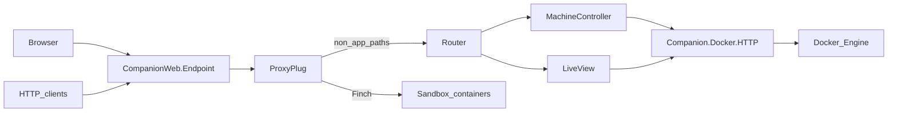

# Architecture (overview)

telvm is a **Phoenix** application (**companion**) on **your computer** that talks to **Docker Engine** over a Unix socket using **Finch**, exposes a **browser UI** (LiveView) and a **JSON + SSE HTTP API** under `/telvm/api`, and **reverse-proxies** HTTP to containers on the Docker bridge via **`CompanionWeb.ProxyPlug`**.

## One-glance mental model (ASCII)

```
+------------------------------------------------------------------+
|  YOUR COMPUTER (one Docker host)                                 |
|                                                                  |
|   [ Browser / agents ] ----http://localhost:4000---->            |
|                              |                                   |
|                              v                                   |
|                    +-------------------+                         |
|                    | telvm companion   |                         |
|                    | (Phoenix + API)   |                         |
|                    +---------+---------+                         |
|                              |                                   |
|              +---------------+---------------+                   |
|              |         Docker Engine         |                  |
|              |   (containers, networks, API)   |                  |
|              +---+---+---------------+---+---+                  |
|                  |   |               |   |                      |
|                  v   v               v   v                      |
|            [Container 1] ... [Container N]                      |
|            (any image, BYOI)   (preview / exec / files)        |
+------------------------------------------------------------------+
```

**Caption:** Companion talks to Docker Engine; you use **one local port** (4000); everything else is **containers** the Engine runs. This is a **local** control plane—not a hosted telecom product.

## Agents, preview, and Explorer (why this matters)

- **Human-readable:** You open **one URL** (`http://localhost:4000`). From there you see **machines**, **health**, and **topology**, and you can drive **lab / pre-flight** flows. **Agents and scripts** (Cursor, Claude Code, Copilot, `curl`) can call the **same** **`/telvm/api`** endpoints—telvm does **not** bundle an LLM.
- **Machine-readable:** The companion implements a thin **HTTP wrapper** over the **Docker Engine API** (container lifecycle, exec, streaming) so tools do not speak raw Engine JSON themselves.
- **Preview:** Browser traffic to a workload can go through **`/app/<container>/port/<port>/…`** (see [Preview URL shape](#preview-url-shape-reverse-proxy)); the companion **proxies** to the container on the bridge network.
- **Explorer (`/explore/:id`):** A **full-viewport** session for **deep visibility** into a container workload—files, editor surface, and room for **exec / logs**-style UX—so you (and agents) are not blind to what runs inside the sandbox. The exact editor widget can change; the **idea** is *visibility into the filesystem and process context the agent uses*.

## Data flow (simplified)



## Main components

| Area | Role |
|------|------|
| [`companion/lib/companion_web/endpoint.ex`](companion/lib/companion_web/endpoint.ex) | **`ProxyPlug` runs before** the router so `/app/...` is proxied without hitting LiveView. |
| [`companion/lib/companion_web/proxy_plug.ex`](companion/lib/companion_web/proxy_plug.ex) | Parses `/app/<container>/port/<n>/…`, forwards with Finch, **502** if upstream fails. |
| [`companion/lib/companion_web/router.ex`](companion/lib/companion_web/router.ex) | LiveView routes (`/`, `/machines`, `/explore/:id`, …) and `/telvm/api/*` JSON API. |
| [`companion/lib/companion/docker/`](companion/lib/companion/docker/) | Behaviour + **HTTP** (real socket) and **Mock** (tests). |
| [`docker-compose.yml`](docker-compose.yml) | Postgres, `vm_node`, **companion**, optional **`companion_test`** profile. |

## Host, Compose, and a single published port

Sandbox workloads are intended to have **no host port bindings** for the workloads themselves; the **companion** publishes **:4000** and reverse-proxies to containers on the Docker bridge (**ProxyPlug** + **Finch**; Engine access via `Companion.Docker.HTTP` and Finch socket pools).

```
  ┌─────────────────────────────────────────── HOST (Docker Desktop VM on Win/macOS) ───────────────────────────────────────────┐
  │                                                                                                                             │
  │   docker compose                                                                                                            │
  │   ┌─────────────────────────────────────────────────────────────────────────────────────────────────────────────────────┐ │
  │   │  bridge network (Compose project)                                                                                    │ │
  │   │                                                                                                                      │ │
  │   │   ┌─────────────────────────────┐      ┌──────────────────────────────┐      ┌──────────────────────────────┐       │ │
  │   │   │  companion (Phoenix/Bandit)  │      │  postgres                     │      │  vm_node (Node; telvm labels) │       │ │
  │   │   │  :4000 ───────► host :4000   │      │  :5432 (internal)             │      │  :3333 (internal HTTP echo)   │       │ │
  │   │   │  + docker.sock (read-only)   │      │                               │      │  example “companion VM”      │       │ │
  │   │   └─────────────────────────────┘      └──────────────────────────────┘      └──────────────────────────────┘       │ │
  │   │                                                                                                                      │ │
  │   └─────────────────────────────────────────────────────────────────────────────────────────────────────────────────────┘ │
  │                                                                                                                             │
  └─────────────────────────────────────────────────────────────────────────────────────────────────────────────────────────────┘
```

## Preview URL shape (reverse proxy)

Browser traffic to sandboxes uses **`/app/<container_name>/port/<port_number>/…`** (container name = Docker bridge DNS hostname). **`CompanionWeb.ProxyPlug`** runs **before** the router, forwards via **Finch** to `http://<container>:<port>/…`, and returns **502** if the upstream is unreachable.

```
  Browser
     │
     │  GET /app/<container_name>/port/<port>/…   (port segment optional; default 3000)
     ▼
  CompanionWeb.ProxyPlug  ──►  Finch → http://<container_name>:<port>/…
```

Examples (see [`CompanionWeb.ProxyPlug.parse_app_path/1`](companion/lib/companion_web/proxy_plug.ex)):

- `["app", "sess_abc"]` → default port **3000**, empty path.
- `["app", "sess_abc", "index.html"]` → default port **3000**, path `index.html`.
- `["app", "sess_abc", "port", "5173", "assets", "a.js"]` → port **5173**, path `assets/a.js`.

## OTP supervision

`Companion.Application` uses **`:rest_for_one`**: foundational processes start before dependents.

```
  Companion.Application (:rest_for_one)
    │
    ├── CompanionWeb.Telemetry
    ├── Phoenix.PubSub
    ├── Companion.Repo
    ├── DNSCluster
    ├── Finch (named Companion.Finch; default + Docker Unix socket pool)
    ├── DynamicSupervisor (Companion.VmLifecycle.RunnerDynamicSupervisor)
    │     └── Companion.VmLifecycle.Runner  (on demand; VM manager pre-flight)
    ├── Companion.PreflightServer  →  PubSub.broadcast("preflight:updates", …)
    └── CompanionWeb.Endpoint       (:4000)
```

Still **planned** (among other roadmap items): richer session UX, per-session `DynamicSupervisor`, `ContainerManager`, `HealthMonitor`, and deeper sandbox automation.

## Why Elixir / OTP

- **Fault containment:** supervision + `DynamicSupervisor` so one bad container or stream does not tear down the whole node.
- **Concurrent I/O:** Docker API calls and proxy traffic map to processes without manual thread pools.
- **LiveView:** long-lived connections suit operator-style UIs.
- **Testable adapters:** `Companion.Docker` behaviour + mock keeps the HTTP-over-socket adapter honest.

“Telecom-grade” in marketing often implies five-nines; what you get from OTP here is **explicit supervision**, **process isolation**, and a **single gateway port**—not magic reliability without good Docker and app semantics.

## Status (shipping)

- [x] Phoenix **companion** under [`companion/`](companion/).
- [x] `Companion.Docker` + [`Mock`](companion/lib/companion/docker/mock.ex) + [`HTTP`](companion/lib/companion/docker/http.ex).
- [x] Pre-flight LiveView + [`Preflight`](companion/lib/companion/preflight.ex) + [`PreflightServer`](companion/lib/companion/preflight_server.ex).
- [x] `CompanionWeb.ProxyPlug` + Finch forwarding; **502** upstream failure ([`proxy_plug_test.exs`](companion/test/companion_web/proxy_plug_test.exs)).
- [x] `/telvm/api/*` — [`MachineController`](companion/lib/companion_web/machine_controller.ex) ([`machine_controller_test.exs`](companion/test/companion_web/machine_controller_test.exs)).
- [x] `/explore/:id` — [`ExplorerLive`](companion/lib/companion_web/live/explorer_live.ex).
- [x] [`docker-compose.yml`](docker-compose.yml) + [`Dockerfile`](Dockerfile).
- [x] VM manager pre-flight + [`Runner`](companion/lib/companion/vm_lifecycle/runner.ex).
- [ ] Session supervisor, richer agent UI, full sandbox image set — next milestones.

## Test strategy

**Canonical:** run ExUnit inside the stack:

```bash
docker compose --profile test run --rm companion_test
```

The [`companion_test`](docker-compose.yml) service runs `mix deps.get && mix test` with `MIX_ENV=test` and `TEST_DATABASE_URL=postgres://postgres:postgres@db:5432/companion_test`. [`config/test.exs`](companion/config/test.exs) reads **`TEST_DATABASE_URL`** first, then **`DATABASE_URL`**.

**Optional (host):** `cd companion && mix test` when Postgres is on `localhost` and test env vars are unset.

**Ad-hoc:**

```bash
docker compose run --rm --entrypoint "" \
  -e MIX_ENV=test \
  -e TEST_DATABASE_URL=postgres://postgres:postgres@db:5432/companion_test \
  companion \
  sh -c "mix deps.get && mix test"
```

### Contracts under test

- [`Companion.Docker.Mock`](companion/test/companion/docker_mock_test.exs)
- [`Companion.Preflight`](companion/test/companion/preflight_test.exs)
- [`CompanionWeb.ProxyPlug`](companion/test/companion_web/proxy_plug_test.exs)
- [`CompanionWeb.MachineController`](companion/test/companion_web/machine_controller_test.exs)
- [`CompanionWeb.StatusLive`](companion/test/companion_web/live/status_live_test.exs)
- [`Companion.VmLifecycle.Runner`](companion/test/companion/vm_lifecycle_runner_test.exs)

**Later:** real-Engine tests tagged (e.g. `@tag :docker`) behind `RUN_DOCKER_TESTS=1`.

## Layout

| Path | Role |
|------|------|
| [`companion/`](companion/) | Phoenix application |
| [`docker-compose.yml`](docker-compose.yml) | Postgres + `vm_node` + companion + `companion_test` (profile `test`) |
| [`Dockerfile`](Dockerfile) | Dev image |
| [`docker/companion-entrypoint.sh`](docker/companion-entrypoint.sh) | deps, assets, ecto, `phx.server` |

## Tests

Hermetic tests use **`Companion.Docker.Mock`**. Canonical CI command: **`docker compose --profile test run --rm companion_test`**.

Private planning notes stay out of this repo (see `.gitignore` for `.internal/`).
