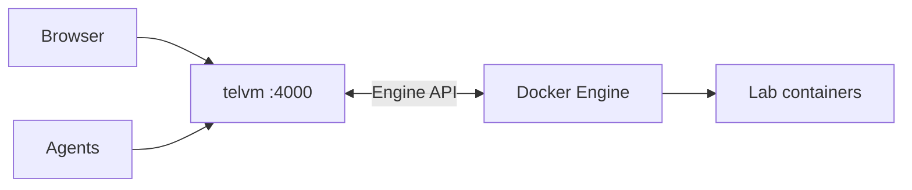
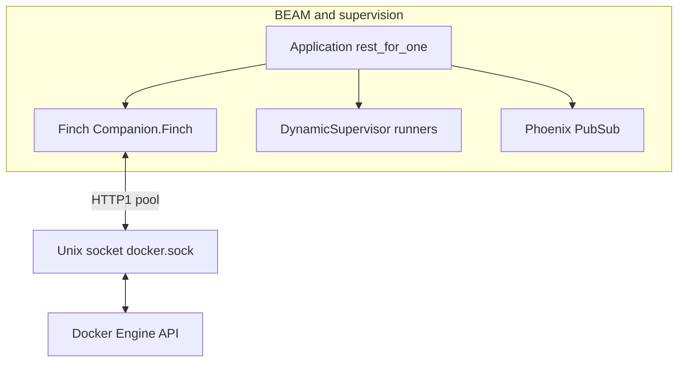

# telvm

[](https://github.com/telvm-hq/telvm/actions/workflows/ci.yml)
[](LICENSE)
[](https://elixir-lang.org/)
[](https://docs.docker.com/compose/)

<p align="center">
  
</p>

### Architecture (overview)



**Full diagram** (stack icons + detail): [docs/assets/ARCHITECTURE-DIAGRAM.md](docs/assets/ARCHITECTURE-DIAGRAM.md).

### Why Elixir / OTP (at a glance)



- **Docker over a Unix socket:** the companion uses **Finch** with a dedicated pool for **`{:http, {:local, docker.sock}}`** so Engine calls are **HTTP/1 over UDS**, pooled and concurrent—no ad hoc thread pools for lifecycle, exec, or list APIs.
- **Fault containment:** **`:rest_for_one`** supervision plus **`DynamicSupervisor`** for VM lifecycle runners; proxy and SSE traffic map to **isolated processes** so one bad upstream or stream is less likely to take down the whole gateway.
- **Operator UX:** **LiveView** and **PubSub** fit long-lived dashboards; **`/telvm/api/stream`** turns the same internal events into **SSE** for agents.

Details: [Architecture — OTP, Finch, and the Docker Unix socket](ARCHITECTURE.md#otp-finch-and-the-docker-unix-socket) and [Why Elixir / OTP](ARCHITECTURE.md#why-elixir--otp).

## Start here (~60 seconds)

1. **Run:** `git clone https://github.com/telvm-hq/telvm.git && cd telvm && docker compose up --build`  
   Default stack: **Postgres**, **`vm_node`** (example labeled sandbox), and the **companion** on **`http://localhost:4000`**.

2. **Operator UI (browser):** [http://localhost:4000](http://localhost:4000) — **checks** (`/`), **Machines** (`/machines`) for container list, **BYOI** / lab images, **VM manager pre-flight**, **soak** flows, **topology** (`/topology`). This is the human-facing dashboard (LiveView).

3. **Agent / automation API:** **`http://localhost:4000/telvm/api`** — JSON for machine lifecycle and **exec**; **SSE** for live updates. **Cursor**, **Claude Code**, **Copilot**, or **`curl`** — full reference: [**Machine API (agents)**](docs/agent-api.md). How live updates relate to the dashboard: [**Plumbing**](docs/plumbing.md). telvm does **not** bundle an LLM.

4. **Preview and visibility:** **`/app/<container>/port/<n>/…`** reverse-proxies HTTP into a container (same links appear as **proxy URLs** from the API and port links on Machines). **`/explore/<container_id>`** is the read-only filesystem + **Monaco** editor shell for code inside a running lab.

**Three URL families on one port:** operator pages (`/`, `/machines`, …), **`/telvm/api/…`** for tools, and **`/app/…` + `/explore/…`** to see and open workloads — [Architecture](ARCHITECTURE.md). **PubSub, SSE vs LiveView, and what agents see vs the UI:** [Plumbing](docs/plumbing.md).

### Glossary

| Term | Meaning |
|------|---------|
| **companion** | The Phoenix app listening on `:4000`; talks to Docker over **`docker.sock`**. |
| **BYOI** | Bring your own container **image** for labs and sandboxes. |
| **Preview** | Path-based proxy: **`/app/<container>/port/<n>/…`** → container on the Docker bridge. |
| **Explorer** | Read-only in-container file browser + editor at **`/explore/:id`** (UI may label it “monaco”). |
| **Machine API** | JSON + SSE under **`/telvm/api`** for agents and scripts — [docs/agent-api.md](docs/agent-api.md). |

### At a glance (same idea as the banner you can draw in Canva)

One **localhost** port (**4000**). **Preview** uses a **path** on that port, not a separate host port per container: `/app/<container>/port/<n>/…` → companion **reverse-proxies** to `http://<container>:<n>/…` on the Docker bridge (details in [Architecture](ARCHITECTURE.md)).

```
+------------------------------------------------------------------+
|  YOUR COMPUTER (one Docker host, :4000 only)                     |
|                                                                  |
|   [ Browser — LiveView UI ] ----+                               |
|                                  +-- http://localhost:4000 ---->|
|   [ Agents / curl / IDEs ] -----+       |                        |
|                                         |                        |
|                    +--------------------+--------------------+   |
|                    | companion (Phoenix)                     |   |
|                    | ProxyPlug /app…  +  dashboard routes   |   |
|                    | + /telvm/api (JSON + SSE)               |   |
|                    +--------------------+--------------------+   |
|                                         |                        |
|                    Docker Engine (socket)                        |
|                         |   |   |                                |
|              [Container 1] … [Container N]                      |
+------------------------------------------------------------------+
```

Replace the SVG above with your **Canva** export when ready: save as **`docs/assets/telvm-banner.png`** and point the `` `src` at that file ([`docs/assets/BANNER.md`](docs/assets/BANNER.md)).

| Layer | Role |
|--------|------|
| **Docker Engine** | Runs containers; companion talks to it via **`docker.sock`**. |
| **Browser** | Operator dashboard on **`/`**, **`/machines`**, **`/topology`**; Preview **`/app/…`**; Explorer **`/explore/…`**. |
| **Agents & scripts** | **`http://localhost:4000/telvm/api/…`** — [Machine API](docs/agent-api.md). |

### More detail (quick reference)

1. **telvm** is a **local** control plane for **AI coding agents** and humans.  
2. One **Phoenix** app (**companion**) beside **Docker Engine** on **your machine**; telvm does **not** replace the Engine.  
3. Uses the **Engine API** (HTTP over the Docker socket) to run and inspect **one or many** containers on the host.  
4. **Local-first** tooling — not a hosted multi-tenant cloud product.  
5. **License:** Apache-2.0 — [**Community**](#community) for contributing, security, and conduct.

<p align="center">
  
</p>

## Docs (detail)

| Doc | Contents |
|-----|----------|
| [docs/quickstart.md](docs/quickstart.md) | `docker compose up`, routes, tests, GHCR lab image, env |
| [docs/agent-api.md](docs/agent-api.md) | **`/telvm/api`** endpoints, SSE events, scope |
| [docs/plumbing.md](docs/plumbing.md) | PubSub topics, dashboard vs **`/telvm/api/stream`**, Docker pull vs SSE |
| [docs/assets/ARCHITECTURE-DIAGRAM.md](docs/assets/ARCHITECTURE-DIAGRAM.md) | Mermaid overview, Simple Icons row |
| [ARCHITECTURE.md](ARCHITECTURE.md) | Diagrams, ProxyPlug, **OTP / Finch / unix socket**, Explorer, agent loop, tests |
| [CHANGELOG.md](CHANGELOG.md) | Version notes; GitHub Releases link |

## Community

- [Contributing](CONTRIBUTING.md) (tests, PRs, branch protection, releases)
- [Architecture](ARCHITECTURE.md)
- [Security policy](SECURITY.md)
- [Code of conduct](CODE_OF_CONDUCT.md)

## License

Apache-2.0 — see [LICENSE](LICENSE).
