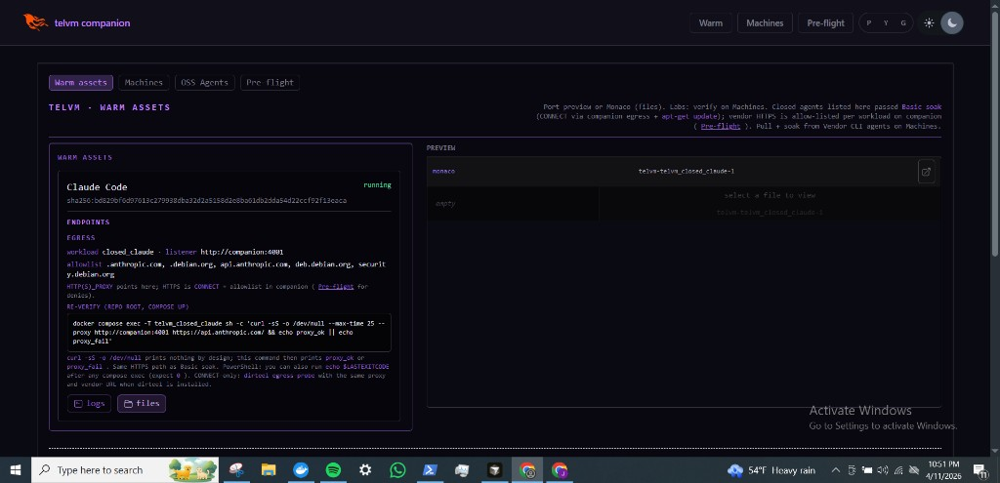
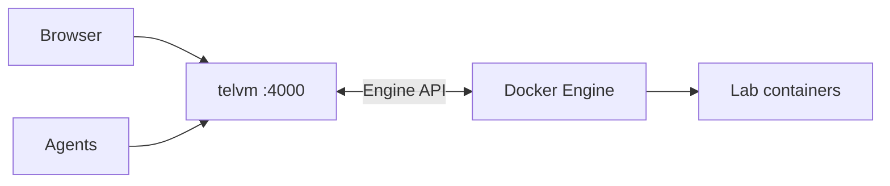
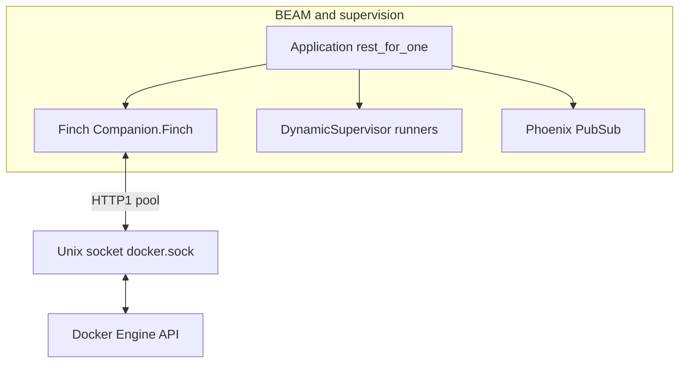

# Agentic Sentinel -- Telecom VM

[](https://github.com/telvm-hq/telvm/actions/workflows/ci.yml)
[](LICENSE)
[](https://elixir-lang.org/)
[](https://docs.docker.com/compose/)

<p align="center">
  
</p>

<p align="center">
  <sub>Pre-flight dashboard sample: <a href="docs/assets/cluster-dashboard.png"><code>docs/assets/cluster-dashboard.png</code></a> · wide hero export notes: <a href="docs/assets/BANNER.md">docs/assets/BANNER.md</a></sub>
</p>

### Recent progress (companion + closed agents)

- **Egress proxy hardening:** listener no longer applies fragile `setopts` after `accept` (avoids RST / curl 56); **CONNECT** parsing fixed so `host:port` is not swallowed into the host token (avoids spurious `malformed_connect` / 403).
- **dirteel** ([`agents/dirteel`](agents/dirteel)): static Zig **CONNECT** probe + **`profiles/closed_images.json`** aligned with [`ClosedAgents.Catalog`](companion/lib/companion/closed_agents/catalog.ex); **`make check-dirteel-catalog`**; closed images ship **`/usr/local/bin/dirteel`**; Basic soak prefers dirteel when present ([`ClosedAgents.Verify`](companion/lib/companion/closed_agents/verify.ex)).
- **Operator UI:** Warm assets and Machines **Vendor CLI** surface workload id, listener URL, and allowlist next to Pre-flight; **Re-verify** command prints **`proxy_ok`** / **`proxy_fail`** so silent `curl` is not mistaken for a hang.

### Suggested PR split (current work)

| Option | PRs | What to bundle |
|--------|-----|----------------|
| **Minimal (2)** | **2** | **PR 1 — Egress + companion:** `egress_proxy` listener/connection fixes, `ClosedAgents.Verify`, any `docker-compose` / `runtime.exs` egress tweaks, tests. **PR 2 — Tooling + UX + docs:** `agents/dirteel`, closed Dockerfiles, `Makefile` / `companion_test` mount, `status_live` Warm/Machines copy, catalog labels, **README** / quickstart pointers. |
| **Granular (3)** | **3** | Split PR 2: **(2a)** dirteel + profiles + CI/catalog sync + image Dockerfiles; **(2b)** LiveView only; **(2c)** README / docs / assets (this banner). |

Pick **2** if you want fewer reviews; pick **3** if reviewers prefer smaller diffs or docs-only PRs land independently.

### Architecture (overview)



**Full diagram** (stack icons + detail): [docs/assets/ARCHITECTURE-DIAGRAM.md](docs/assets/ARCHITECTURE-DIAGRAM.md).

### Why Elixir / OTP (at a glance)



- **Docker over a Unix socket:** the companion uses **Finch** with a dedicated pool for **`{:http, {:local, docker.sock}}`** so Engine calls are **HTTP/1 over UDS**, pooled and concurrent—no ad hoc thread pools for lifecycle, exec, or list APIs.
- **Fault containment:** **`:rest_for_one`** supervision plus **`DynamicSupervisor`** for VM lifecycle runners; proxy and SSE traffic map to **isolated processes** so one bad upstream or stream is less likely to take down the whole gateway.
- **Operator UX:** **LiveView** and **PubSub** fit long-lived dashboards; **`/telvm/api/stream`** turns the same internal events into **SSE** for agents.

Details: [Architecture — OTP, Finch, and the Docker Unix socket](docs/ARCHITECTURE.md#otp-finch-and-the-docker-unix-socket) and [Why Elixir / OTP](docs/ARCHITECTURE.md#why-elixir--otp).

## Start here (~60 seconds)

**Wiki / positioning:** single doc index plus the politely scathing landscape — [docs/wiki/README.md](docs/wiki/README.md).

1. **Run:** `git clone https://github.com/telvm-hq/telvm.git && cd telvm && docker compose up --build`  
   Default stack: **Postgres**, **`vm_node`**, **Ollama** + one-shot **`ollama_pull`**, **Goose**, **companion** on **`http://localhost:4000`**, **`telvm_closed_claude`** / **`telvm_closed_codex`** (vendor CLIs with **`HTTP_PROXY`** to the companion’s egress listeners on **4001** / **4002**). No **`.env`** file is required — defaults are in **`docker-compose.yml`**. After the stack is healthy, verify proxy path: **`./scripts/verify-closed-agent-egress.sh`** (or **`scripts/verify-closed-agent-egress.ps1`** on Windows) — vendor **`curl`** checks plus **`apt-get update`** through the proxy — then **`docker compose logs companion`** and search for **`egress_proxy`** (e.g. **`grep egress_proxy`** or **`findstr egress_proxy`**).

2. **Operator UI (browser):** [http://localhost:4000](http://localhost:4000) redirects to **Pre-flight** (`/health`); **Machines** (`/machines`) lists containers, **BYOI** / lab images, **Verify** (VM manager pre-flight + 15s soak) and **Extended soak (60s)**, plus **Vendor CLI agents** (Claude Code / Codex): **pull** published images, **Basic soak** (egress + apt), then **Warm assets** (`/warm`). Step-by-step for clones (including **curl exit 56** triage): **[docs/quickstart.md — Vendor CLI agents (5 min)](docs/quickstart.md#vendor-cli-agents-5-min)**. Human-facing dashboard (LiveView). **Core loop (labs):** pull any lab image, run **Verify**; when it passes, that container shows up on **Warm assets** with port preview, **files** (Explorer / Monaco), and **container logs** (same log text is available to agents at **`GET /telvm/api/machines/:id/logs`**).

3. **Optional — OSS Agents (`/oss-agents`, bookmark `/agent` redirects):** Local **[Ollama](https://ollama.com/)** (OpenAI-compatible HTTP API) runs as a **separate Compose service**; model weights live in Ollama’s Docker volume, **not** inside Phoenix. The optional **Goose** service uses Engine **exec** for in-container agent turns. Runbook: **[docs/quickstart.md — Ollama & OSS Agents](docs/quickstart.md#ollama-oss-agents--cpu-smoke)**.

4. **Agent / automation API:** **`http://localhost:4000/telvm/api`** — JSON for machine lifecycle and **exec**; **SSE** for live updates. **Cursor**, **Claude Code**, **Copilot**, or **`curl`** — full reference: [**Machine API (agents)**](docs/agent-api.md). How live updates relate to the dashboard: [**Plumbing**](docs/plumbing.md). The companion does **not** embed model weights or an inference runtime in the BEAM; use Ollama (or another server) beside the stack if you want local chat from the UI.

   **Cursor MCP:** Build the small MCP server in [`mcp/`](mcp/) and register it in Cursor so agents call **telvm tools** (list/exec/delete machines, etc.) instead of hand-written HTTP — [**MCP + Cursor setup**](docs/mcp-cursor.md).

5. **Preview and visibility:** **`/app/<container>/port/<n>/…`** reverse-proxies HTTP into a container (same links appear as **proxy URLs** from the API and port links on Machines). **`/explore/<container_id>`** is the read-only filesystem + **Monaco** editor shell for code inside a running lab.

6. **Optional — Cluster nodes (Ubuntu hosts with Docker Engine):** Deploy the lightweight **[`telvm-node-agent`](agents/telvm-node-agent/README.md)** (Zig binary) to each host; it exposes `/health` and proxies a narrow Docker Engine slice over HTTP. Set **`TELVM_CLUSTER_NODES`** (JSON array) and **`TELVM_CLUSTER_TOKEN`** in **`.env`** (see **`.env.example`**); the companion's **`Companion.ClusterNodePoller`** polls each agent and broadcasts results on PubSub — Pre-flight shows a **cluster nodes** table when configured. For **physical LAN bring-up** (networking, netplan, ICS), see **[docs/lan-cluster-network-primer.md](docs/lan-cluster-network-primer.md)** and **[inventories/lan-host/README.md](inventories/lan-host/README.md)**.

**Operator surfaces on one port:** dashboard pages (`/`, `/health`, `/warm`, `/machines`, **`/oss-agents`** (`/agent` redirects; legacy **`/other-agents`** redirects to **`/machines`**), …), **`/telvm/api/…`** for tools, and **`/app/…` + `/explore/…`** to see and open workloads — [Architecture](docs/ARCHITECTURE.md). **`/topology`** redirects to **`/warm`** (bookmark compatibility). **PubSub, SSE vs LiveView, and what agents see vs the UI:** [Plumbing](docs/plumbing.md).

### Glossary

| Term | Meaning |
|------|---------|
| **companion** | The Phoenix app listening on `:4000`; talks to Docker over **`docker.sock`**. |
| **BYOI** | Bring your own container **image** for labs and sandboxes. |
| **Warm assets** | Operator tab at **`/warm`** for lab containers after **Verify**: status, port preview, Explorer, logs, and a **network blueprint** (ASCII: Compose stack + bridge + lab cards). |
| **Preview** | Path-based proxy: **`/app/<container>/port/<n>/…`** → container on the Docker bridge. |
| **Explorer** | Read-only in-container file browser + editor at **`/explore/:id`** (UI may label it “monaco”). |
| **Machine API** | JSON + SSE under **`/telvm/api`** for agents and scripts — [docs/agent-api.md](docs/agent-api.md). |
| **OSS Agents** | Tab **`/oss-agents`**: Ollama model list + chat (Finch), Goose via **exec** — [quickstart](docs/quickstart.md#ollama-oss-agents--cpu-smoke). |

### At a glance (same idea as the banner you can draw in Canva)

One **localhost** port (**4000**). **Preview** uses a **path** on that port, not a separate host port per container: `/app/<container>/port/<n>/…` → companion **reverse-proxies** to `http://<container>:<n>/…` on the Docker bridge (details in [Architecture](docs/ARCHITECTURE.md)).

```
+------------------------------------------------------------------+
|  YOUR COMPUTER (one Docker host, :4000 only)                     |
|                                                                  |
|   [ Browser — LiveView UI ] ----+                               |
|                                  +-- http://localhost:4000 ---->|
|   [ Agents / curl / IDEs ] -----+       |                        |
|                                         |                        |
|                    +--------------------+--------------------+   |
|                    | companion (Phoenix)                     |   |
|                    | ProxyPlug /app…  +  dashboard routes   |   |
|                    | + /telvm/api (JSON + SSE)               |   |
|                    +--------------------+--------------------+   |
|                                         |                        |
|                    Docker Engine (socket)                        |
|                         |   |   |                                |
|              [Container 1] … [Container N]                      |
+------------------------------------------------------------------+
```

README hero (Warm assets): [`docs/assets/warm-assets-banner.png`](docs/assets/warm-assets-banner.png). Alternate wide hero: [`docs/assets/TELVM_IMAGE_BANNER.png`](docs/assets/TELVM_IMAGE_BANNER.png). Sizes and GitHub social preview: [`docs/assets/BANNER.md`](docs/assets/BANNER.md).

| Layer | Role |
|--------|------|
| **Docker Engine** | Runs containers; companion talks to it via **`docker.sock`**. |
| **Browser** | Operator dashboard on **`/health`**, **`/warm`**, **`/machines`**, **`/oss-agents`**; Preview **`/app/…`**; Explorer **`/explore/…`**. |
| **Agents & scripts** | **`http://localhost:4000/telvm/api/…`** — [Machine API](docs/agent-api.md). |

### More detail (quick reference)

1. **telvm** is a **local** control plane for **AI coding agents** and humans.  
2. One **Phoenix** app (**companion**) beside **Docker Engine** on **your machine**; telvm does **not** replace the Engine.  
3. Uses the **Engine API** (HTTP over the Docker socket) to run and inspect **one or many** containers on the host.  
4. **Local-first** tooling — not a hosted multi-tenant cloud product.  
5. **License:** Apache-2.0 — [**Community**](#community) for contributing, security, and conduct.

<p align="center">
  
</p>

## Docs (detail)

| Doc | Contents |
|-----|----------|
| [docs/quickstart.md](docs/quickstart.md) | `docker compose up`, routes, tests, GHCR lab image, env |
| [docs/agent-api.md](docs/agent-api.md) | **`/telvm/api`** endpoints, SSE events, scope |
| [docs/mcp-cursor.md](docs/mcp-cursor.md) | **Cursor + MCP**: build `mcp/`, `.cursor/mcp.json`, verify tools |
| [docs/plumbing.md](docs/plumbing.md) | PubSub topics, dashboard vs **`/telvm/api/stream`**, Docker pull vs SSE |
| [docs/assets/ARCHITECTURE-DIAGRAM.md](docs/assets/ARCHITECTURE-DIAGRAM.md) | Mermaid overview, Simple Icons row |
| [docs/ARCHITECTURE.md](docs/ARCHITECTURE.md) | Diagrams, ProxyPlug, **OTP / Finch / unix socket**, Explorer, agent loop, tests |
| [docs/CHANGELOG.md](docs/CHANGELOG.md) | Version notes; GitHub Releases link |

## Community

- [Contributing](docs/CONTRIBUTING.md) (tests, PRs, branch protection, releases)
- [Architecture](docs/ARCHITECTURE.md)
- [Security policy](docs/SECURITY.md)
- [Code of conduct](docs/CODE_OF_CONDUCT.md)

## License

Apache-2.0 — see [LICENSE](LICENSE).
