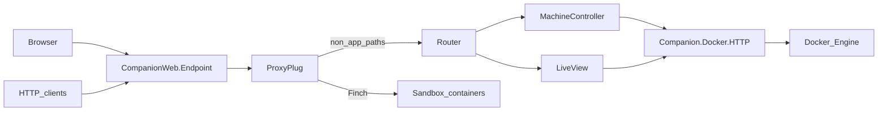
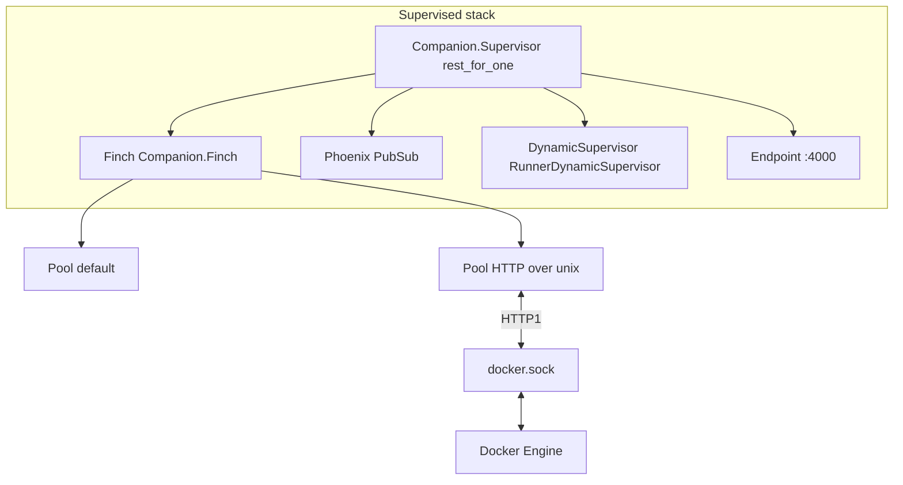

# Architecture (overview)

telvm is a **Phoenix** application (**companion**) on **your computer** that talks to **Docker Engine** over a Unix socket using **Finch**, exposes a **browser UI** (LiveView) and a **JSON + SSE HTTP API** under `/telvm/api`, and **reverse-proxies** HTTP to containers on the Docker bridge via **`CompanionWeb.ProxyPlug`**.

**Read order**

- **Visual overview (Mermaid + icons)** — [assets/ARCHITECTURE-DIAGRAM.md](assets/ARCHITECTURE-DIAGRAM.md) (companion as host peer to Docker Engine; one port `:4000`).
- **Why Elixir / OTP and the Docker socket** — [OTP, Finch, and the Docker Unix socket](#otp-finch-and-the-docker-unix-socket) and [Why Elixir / OTP](#why-elixir--otp).
- **Integrating an agent or script** — start with [agent-api.md](agent-api.md), then [plumbing.md](plumbing.md) for why the UI and **`/telvm/api/stream`** share some lifecycle events (and which updates are UI-only), then [`machine_controller.ex`](../companion/lib/companion_web/machine_controller.ex) for implementation details.
- **Running the stack locally** — [quickstart.md](quickstart.md) and the Compose diagram under [Host, Compose, and a single published port](#host-compose-and-a-single-published-port) below.
- **Closed-inference agents (Claude / Codex) + Windows network agent** — [closed-agent-network-harness-contract.md](closed-agent-network-harness-contract.md) and linked docs (wireframe, Docker labels, integration test matrix, submodule policy). Published GHCR images: [`images/telvm-closed-claude`](../images/telvm-closed-claude/README.md), [`images/telvm-closed-codex`](../images/telvm-closed-codex/README.md).

## One-glance mental model (ASCII)

**You publish one host port (`:4000`).** Container workloads usually **do not** get their own `localhost:<random>` port. Instead, **path-based preview** on the companion maps a **branded URL shape** to **container + in-container port** on the Docker bridge.

The stable prefix is **`/app/`** (not a session cookie path). Today’s contract is:

`http://localhost:4000/app/<container_name>/port/<port_number>/<path…>`

…which **`ProxyPlug`** turns into `http://<container_name>:<port_number>/<path…>` using **bridge DNS** (`container_name` must resolve on the Compose network). See [`proxy_plug.ex`](../companion/lib/companion_web/proxy_plug.ex).

```
+------------------------------------------------------------------+
| YOUR COMPUTER — one published port :4000                         |
|                                                                  |
|  [ Browser — LiveView, /app, /explore ] ----+                    |
|                                              +--> :4000          |
|  [ Agents / curl — /telvm/api ] ------------+                    |
|           |                                                      |
|           |  http://localhost:4000/app/<name>/port/<n>/…       |
|           |  http://localhost:4000/telvm/api/…   (JSON/SSE)    |
|           v                                                      |
|  +------------------------ companion ---------------------------+ |
|  |  CompanionWeb.ProxyPlug runs FIRST (before the router)     | |
|  |  /app/<container>/port/<n>/…  --->  Finch HTTP client      | |
|  |         |                              |                   | |
|  |         |  forward to                  |  everything else | |
|  |         v                              v  (/, /machines,    | |
|  |   http://<container>:<n>/…            |   /explore, …)   | |
|  |   (bridge network DNS + port)          +--> Router/LiveView | |
|  +------------------------|----------------|-------------------+ |
|                           |                |                      |
|                           |  Docker Engine API (UNIX socket)     |
|                           v                                      |
|                    +-------------+                               |
|                    |Docker Engine|                               |
|                    +------+------+                               |
|                           |                                      |
|                           v                                      |
|              [ Container A :3000 ] … [ Container N :… ]          |
|              BYOI; internal ports stay on the bridge (not host)   |
+------------------------------------------------------------------+
```

**Why this is not “random localhost ports”:** You are not opening **N host ports** for **N** container ports. You keep **one** entrypoint (`:4000`) and encode **which container** and **which internal port** in the **path** (`/app/.../port/<n>/...`). That is the graceful mapping: **slug (path) → container:port on the bridge**.

**Caption:** One local port; Engine runs the VMs; companion **terminates HTTP** and **proxies** `/app/…` to the right **container:port**; **Explorer** and **`/telvm/api`** use the same host for visibility and automation.

## Agents, preview, and Explorer (why this matters)

- **Human-readable:** You open **one URL** (`http://localhost:4000`). From there you see **machines**, **health**, and **topology**, and you can drive **lab / pre-flight** flows. **Agents and scripts** (Cursor, Claude Code, Copilot, `curl`) can call the **same** **`/telvm/api`** endpoints—telvm does **not** bundle an LLM.
- **Machine-readable:** The companion implements a thin **HTTP wrapper** over the **Docker Engine API** (container lifecycle, exec, streaming) so tools do not speak raw Engine JSON themselves.
- **Preview:** Browser traffic to a workload can go through **`/app/<container>/port/<port>/…`** (see [Preview URL shape](#preview-url-shape-reverse-proxy)); the companion **proxies** to the container on the bridge network.
- **Explorer (`/explore/:id`):** A **full-viewport** session for **deep visibility** into a container workload—files, editor surface, and room for **exec / logs**-style UX—so you (and agents) are not blind to what runs inside the sandbox. The exact editor widget can change; the **idea** is *visibility into the filesystem and process context the agent uses*.

## Data flow (simplified)



## Main components

| Area | Role |
|------|------|
| [`companion/lib/companion_web/endpoint.ex`](../companion/lib/companion_web/endpoint.ex) | **`ProxyPlug` runs before** the router so `/app/...` is proxied without hitting LiveView. |
| [`companion/lib/companion_web/proxy_plug.ex`](../companion/lib/companion_web/proxy_plug.ex) | Parses `/app/<container>/port/<n>/…`, forwards with Finch, **502** if upstream fails. |
| [`companion/lib/companion_web/router.ex`](../companion/lib/companion_web/router.ex) | LiveView routes (`/`, `/machines`, `/explore/:id`, **`/oss-agents`** (legacy **`/agent`** redirects), legacy **`/other-agents`** → **`/machines`**, …) and `/telvm/api/*` JSON API. |
| [`companion/lib/companion/docker/`](../companion/lib/companion/docker/) | Behaviour + **HTTP** (real socket) and **Mock** (tests). |
| [`docker-compose.yml`](../docker-compose.yml) | Postgres, `vm_node`, **companion**, optional **Ollama** + **Goose** + **ollama_pull**, optional **`companion_test`** profile. |

### Optional: OSS Agents and CPU inference

The **OSS Agents** tab (`/oss-agents` in [`StatusLive`](../companion/lib/companion_web/live/status_live.ex); legacy **`/agent`** redirects) is **additive**: it does not change **`ProxyPlug`** or **`/telvm/api`**.

- **Model chat (Ollama or any OpenAI-compatible server):** [**`Companion.InferencePreflight`**](../companion/lib/companion/inference_preflight.ex) lists models; [**`Companion.InferenceChat`**](../companion/lib/companion/inference_chat.ex) posts to **`/v1/chat/completions`** using **Finch** to the configured base URL (same **`Companion.Finch`** pool as other outbound HTTP, **not** the `/app/…` proxy path).
- **Goose agent:** [**`Companion.GooseRuntime`**](../companion/lib/companion/goose_runtime.ex) discovers a container with label **`telvm.goose=true`** and runs **`goose run --text`** via **`Companion.Docker.HTTP`** **exec** (same Engine API as Machines). This is **not** the same as **Warm assets** / lab containers (**`telvm.vm_manager_lab=true`**).
- **Health:** [**`Companion.GooseHealth`**](../companion/lib/companion/goose_health.ex) periodically probes the Goose container and publishes to LiveView.
- **Vendor CLI agents (on Machines):** closed vendor containers (**`telvm.agent=closed`**) can run **Basic soak** (Engine **exec**: curl via egress proxy + `apt-get update`); on success they register in **`Companion.ClosedAgentWarmRegistry`** and appear on **Warm assets** alongside labs (in-memory until companion restart). Compose project for discovery defaults to **`telvm`**; override with **`TELVM_COMPOSE_PROJECT`** if needed.

Configure inference URLs and default model at runtime ([`config/runtime.exs`](../companion/config/runtime.exs)); operators configure Goose inside the Goose container (`goose configure`). See [quickstart — Ollama & OSS Agents](quickstart.md#ollama-oss-agents--cpu-smoke).

## Host, Compose, and a single published port

Sandbox workloads are intended to have **no host port bindings** for the workloads themselves; the **companion** publishes **:4000** and reverse-proxies to containers on the Docker bridge (**ProxyPlug** + **Finch**; Engine access via `Companion.Docker.HTTP` and Finch socket pools).

```
  ┌─────────────────────────────────────────── HOST (Docker Desktop VM on Win/macOS) ───────────────────────────────────────────┐
  │                                                                                                                             │
  │   docker compose                                                                                                            │
  │   ┌─────────────────────────────────────────────────────────────────────────────────────────────────────────────────────┐ │
  │   │  bridge network (Compose project)                                                                                    │ │
  │   │                                                                                                                      │ │
  │   │   ┌─────────────────────────────┐      ┌──────────────────────────────┐      ┌──────────────────────────────┐       │ │
  │   │   │  companion (Phoenix/Bandit)  │      │  postgres                     │      │  vm_node (Node; telvm labels) │       │ │
  │   │   │  :4000 ───────► host :4000   │      │  :5432 (internal)             │      │  :3333 (internal HTTP echo)   │       │ │
  │   │   │  + docker.sock (read-only)   │      │                               │      │  example “companion VM”      │       │ │
  │   │   └─────────────────────────────┘      └──────────────────────────────┘      └──────────────────────────────┘       │ │
  │   │                                                                                                                      │ │
  │   └─────────────────────────────────────────────────────────────────────────────────────────────────────────────────────┘ │
  │                                                                                                                             │
  └─────────────────────────────────────────────────────────────────────────────────────────────────────────────────────────────┘
```

The default **Compose** file can also run **Ollama** (inference API on the bridge) and **Goose** (CLI agent container); the companion reaches Ollama over HTTP and the Goose container via **Engine exec** — see [Optional: OSS Agents and CPU inference](#optional-oss-agents-and-cpu-inference) above.

## Preview URL shape (reverse proxy)

Browser traffic to sandboxes uses **`/app/<container_name>/port/<port_number>/…`** (container name = Docker bridge DNS hostname). **`CompanionWeb.ProxyPlug`** runs **before** the router, forwards via **Finch** to `http://<container>:<port>/…`, and returns **502** if the upstream is unreachable.

```
  Browser
     │
     │  GET /app/<container_name>/port/<port>/…   (port segment optional; default 3000)
     ▼
  CompanionWeb.ProxyPlug  ──►  Finch → http://<container_name>:<port>/…
```

Examples (see [`CompanionWeb.ProxyPlug.parse_app_path/1`](../companion/lib/companion_web/proxy_plug.ex)):

- `["app", "sess_abc"]` → default port **3000**, empty path.
- `["app", "sess_abc", "index.html"]` → default port **3000**, path `index.html`.
- `["app", "sess_abc", "port", "5173", "assets", "a.js"]` → port **5173**, path `assets/a.js`.

## OTP supervision

`Companion.Application` uses **`:rest_for_one`**: foundational processes start before dependents.

```
  Companion.Application (:rest_for_one)
    │
    ├── CompanionWeb.Telemetry
    ├── Phoenix.PubSub
    ├── Companion.Repo
    ├── DNSCluster
    ├── Finch (named Companion.Finch; default + Docker Unix socket pool)
    ├── DynamicSupervisor (Companion.VmLifecycle.RunnerDynamicSupervisor)
    │     └── Companion.VmLifecycle.Runner  (on demand; VM manager pre-flight)
    ├── Companion.PreflightServer  →  PubSub.broadcast("preflight:updates", …)
    └── CompanionWeb.Endpoint       (:4000)
```

Still **planned** (among other roadmap items): richer session UX, per-session `DynamicSupervisor`, `ContainerManager`, `HealthMonitor`, and deeper sandbox automation.

## OTP, Finch, and the Docker Unix socket

The companion does not shell out to the `docker` CLI for control-plane calls. It speaks the **Docker Engine HTTP API** over the **Unix domain socket** (`docker.sock` by default), using **Finch** connection pools defined in [`application.ex`](../companion/lib/companion/application.ex):

- **`:default`** pool — general HTTP (including **ProxyPlug** forwards to `http://<container>:<port>/…` on the bridge).
- **`{:http, {:local, sock}}`** pool — **HTTP/1 only** to the Engine on the socket (`hostname: "localhost"` in `conn_opts` is how Mint/Finch addresses UDS HTTP).

That split keeps **many concurrent** Engine requests (list, inspect, exec, attach) and **many concurrent** proxy streams from fighting for the same pool limits.



**Benefit:** OTP-style **process-per-request** (or per-connection) semantics for LiveView, SSE, and plugs means **blocking or slow Docker I/O** in one client does not require a giant thread pool; the VM schedules **many lightweight processes** over a small number of pooled connections.

## Why Elixir / OTP

- **Fault containment:** **`Companion.Supervisor`** uses **`:rest_for_one`** so if a foundational child fails, dependents restart in order. **`DynamicSupervisor`** starts **`Companion.VmLifecycle.Runner`** processes on demand for VM manager pre-flight—runaway lab work is easier to bound than a single global worker.
- **Unix socket + HTTP in one client:** Finch’s **local socket pool** gives you **keep-alive and concurrency caps** against `docker.sock` without inventing a separate transport stack; **`Companion.Docker.HTTP`** uses **`Finch.build/5`** and **`Finch.request/3`** against **`Companion.Finch`** (including `unix_socket:` on the request).
- **Concurrent I/O:** Docker API calls, **ProxyPlug** streaming, and LiveView channels are **process-isolated**; you get back-pressure and failure modes per connection instead of one shared mutable client.
- **LiveView + PubSub:** long-lived operator UI; internal **`Phoenix.PubSub`** broadcasts feed both **LiveView** (`handle_info`) and **`MachineController`** SSE subscribers ([Plumbing](plumbing.md)).
- **Testable adapters:** `Companion.Docker` **behaviour** + **`Mock`** keeps the HTTP-over-socket contract covered in CI without a real Engine.

“Telecom-grade” in marketing often implies five-nines; what you get from OTP here is **explicit supervision**, **process isolation**, **pooled UDS HTTP to Docker**, and a **single gateway port**—not magic reliability without good Docker and app semantics.

## Status (shipping)

- [x] Phoenix **companion** under [`companion/`](../companion/).
- [x] `Companion.Docker` + [`Mock`](../companion/lib/companion/docker/mock.ex) + [`HTTP`](../companion/lib/companion/docker/http.ex).
- [x] Pre-flight LiveView + [`Preflight`](../companion/lib/companion/preflight.ex) + [`PreflightServer`](../companion/lib/companion/preflight_server.ex).
- [x] `CompanionWeb.ProxyPlug` + Finch forwarding; **502** upstream failure ([`proxy_plug_test.exs`](../companion/test/companion_web/proxy_plug_test.exs)).
- [x] `/telvm/api/*` — [`MachineController`](../companion/lib/companion_web/machine_controller.ex) ([`machine_controller_test.exs`](../companion/test/companion_web/machine_controller_test.exs)).
- [x] `/explore/:id` — [`ExplorerLive`](../companion/lib/companion_web/live/explorer_live.ex).
- [x] [`docker-compose.yml`](../docker-compose.yml) + [`Dockerfile`](../Dockerfile).
- [x] VM manager pre-flight + [`Runner`](../companion/lib/companion/vm_lifecycle/runner.ex).
- [ ] Session supervisor, richer agent UI, full sandbox image set — next milestones.

## Test strategy

**Canonical:** run ExUnit inside the stack:

```bash
docker compose --profile test run --rm companion_test
```

The [`companion_test`](../docker-compose.yml) service runs `mix deps.get && mix test` with `MIX_ENV=test` and `TEST_DATABASE_URL=postgres://postgres:postgres@db:5432/companion_test`. [`config/test.exs`](../companion/config/test.exs) reads **`TEST_DATABASE_URL`** first, then **`DATABASE_URL`**.

**Optional (host):** `cd companion && mix test` when Postgres is on `localhost` and test env vars are unset.

**Optional (integration, egress):** with the default **`docker compose up`** stack running on the host, **`make smoke-closed-egress`** runs [`scripts/verify-closed-agent-egress.sh`](../scripts/verify-closed-agent-egress.sh) (see [quickstart — Tests](quickstart.md#tests)). This exercises real Engine + vendor **`curl`** paths; it is not part of ExUnit.

**Ad-hoc:**

```bash
docker compose run --rm --entrypoint "" \
  -e MIX_ENV=test \
  -e TEST_DATABASE_URL=postgres://postgres:postgres@db:5432/companion_test \
  companion \
  sh -c "mix deps.get && mix test"
```

### Contracts under test

- [`Companion.Docker.Mock`](../companion/test/companion/docker_mock_test.exs)
- [`Companion.Preflight`](../companion/test/companion/preflight_test.exs)
- [`CompanionWeb.ProxyPlug`](../companion/test/companion_web/proxy_plug_test.exs)
- [`CompanionWeb.MachineController`](../companion/test/companion_web/machine_controller_test.exs)
- [`CompanionWeb.StatusLive`](../companion/test/companion_web/live/status_live_test.exs)
- [`Companion.VmLifecycle.Runner`](../companion/test/companion/vm_lifecycle_runner_test.exs)

**Later:** real-Engine ExUnit tagged (e.g. `@tag :docker`) behind `RUN_DOCKER_TESTS=1`; until then prefer **`make smoke-closed-egress`** for closed-agent egress regressions.

## Layout

| Path | Role |
|------|------|
| [`companion/`](../companion/) | Phoenix application |
| [`docker-compose.yml`](../docker-compose.yml) | Postgres + `vm_node` + companion + `companion_test` (profile `test`) |
| [`Dockerfile`](../Dockerfile) | Dev image |
| [`docker/companion-entrypoint.sh`](../docker/companion-entrypoint.sh) | deps, assets, ecto, `phx.server` |

## Tests

Hermetic tests use **`Companion.Docker.Mock`**. Canonical CI command: **`docker compose --profile test run --rm companion_test`**.

Private planning notes stay out of this repo (see `.gitignore` for `.internal/`).
