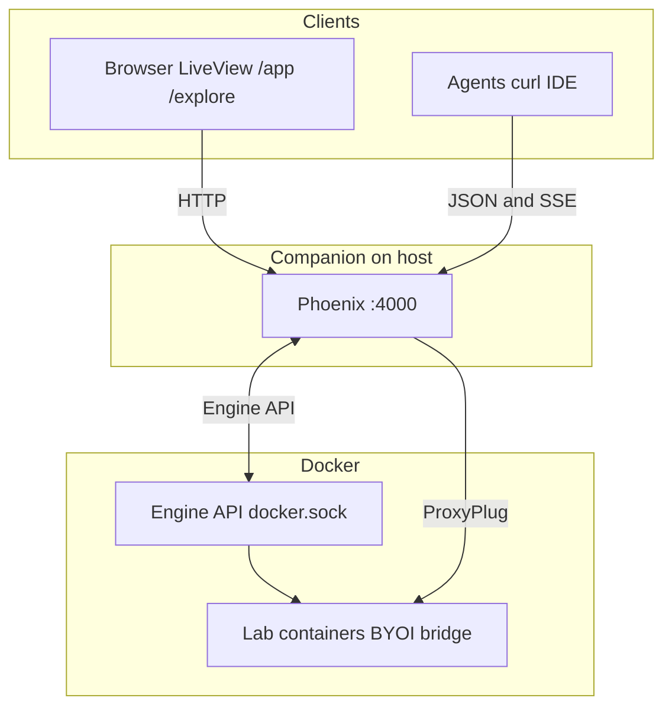

# Architecture diagram (Mermaid + icons)

Accurate high-level layout: the **companion** is a **peer** on the host that **calls** Docker Engine over **`docker.sock`**; containers do not open SSE into telvm. For **PubSub**, **SSE vs LiveView**, and **`machines_snapshot`**, see [Plumbing](../plumbing.md).

Icons below are from **[Simple Icons](https://simpleicons.org/)** (CC0 1.0), loaded from [jsDelivr](https://www.jsdelivr.com/package/npm/simple-icons).

  
  &nbsp;
  
  &nbsp;
  

## Diagram

**Caption:** One published host port (**`:4000`**) for the dashboard, Preview paths, Explorer, and **`/telvm/api`**. The companion **pulls** container state via the Engine API and **pushes** SSE to clients that subscribe to **`/telvm/api/stream`**; see [Plumbing](../plumbing.md).

## Licenses

- **Simple Icons** — [CC0 1.0](https://github.com/simple-icons/simple-icons/blob/develop/LICENSE.md).
