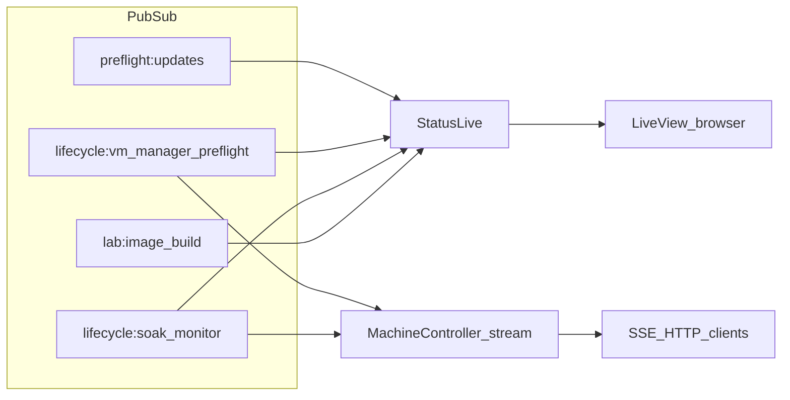

# Plumbing: dashboard vs agents, live updates

This page explains **what the operator UI reflects** versus **what HTTP clients get** on **`/telvm/api`**, without tracing every module.

## One port, two audiences

Everything listens on **`http://localhost:4000`**:

| Audience | Surfaces |
|----------|----------|
| **Browser** | LiveView **Pre-flight** (`/health`), **Machines** (`/machines`); **[Preview](../companion/lib/companion_web/proxy_plug.ex)** at **`/app/<container>/port/<n>/…`**; **Explorer** at **`/explore/:id`**; FYI markdown at **`/telvm/api/fyi`**. |
| **Agents / scripts** | JSON and **SSE** under **`/telvm/api`** — [Machine API (agents)](agent-api.md). |

LiveView pages use Phoenix’s **WebSocket** channel for the UI. The **Machine API** stream is plain **HTTP SSE** (`GET /telvm/api/stream`).

## Internal bus: Phoenix PubSub

The companion broadcasts lifecycle and status messages on **named topics**. Implementations live in [`preflight.ex`](../companion/lib/companion/preflight.ex), [`vm_lifecycle.ex`](../companion/lib/companion/vm_lifecycle.ex), [`soak_runner.ex`](../companion/lib/companion/vm_lifecycle/soak_runner.ex), and [`lab_image_builder.ex`](../companion/lib/companion/lab_image_builder.ex).

| Topic | Role |
|-------|------|
| `preflight:updates` | Platform **checks** row on `/` (Postgres, Docker socket, ProxyPlug, labeled discovery, etc.). |
| `lifecycle:vm_manager_preflight` | **VM manager pre-flight** phases and completion. |
| `lifecycle:soak_monitor` | **Soak** monitor session phases and completion. |
| `lab:image_build` | **Lab image build** progress on Machines. |

**[`StatusLive`](../companion/lib/companion_web/live/status_live.ex)** subscribes to **all four** topics and updates the dashboard via `handle_info`.

**[`MachineController.stream/2`](../companion/lib/companion_web/machine_controller.ex)** subscribes only to **`lifecycle:soak_monitor`** and **`lifecycle:vm_manager_preflight`**. Those messages become **SSE** events (`soak_session`, `soak_done`, `preflight_session`, `preflight_done`) as documented in [agent-api.md](agent-api.md).

So: **platform preflight** and **lab image build** are **LiveView-only** for live updates today. Agents watching **`/telvm/api/stream`** do **not** receive duplicate events for those topics unless the product adds them later.

## Periodic truth: `machines_snapshot`

In addition to PubSub-driven events, the SSE loop **re-lists** labeled lab machines from **Docker** on a timer (about every **5 seconds**) and emits **`machines_snapshot`**. That is the companion **pulling** Engine state, not a container **pushing** telemetry into telvm.

## Honest boundary

- Containers do **not** open an **SSE** connection **to** the companion.
- telvm uses the **Docker Engine API** (HTTP over **`docker.sock`**) to **inspect**, **run**, **exec**, and **remove** workloads.
- **PubSub** (and the snapshot timer) **push** derived updates to **subscribers**: LiveView for the UI, and the SSE connection for API clients.

## See also

- [Machine API](agent-api.md) — REST paths and SSE event names.
- [Architecture](ARCHITECTURE.md) — ProxyPlug order, Compose layout, tests.
