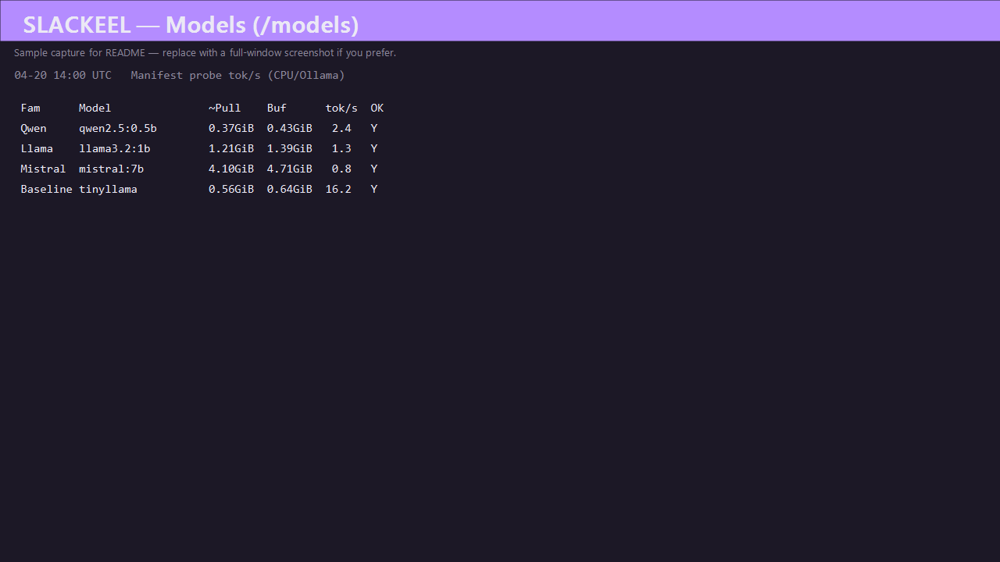

# Slackeel

Self-hostable team collaboration and **local inference** orchestration.

## Repository layout (important)

**Full Slackeel development—including the Phoenix app and Pre-flight dashboard—is intended to run inside the [`telvm-hq/telvm`](https://github.com/telvm-hq/telvm) monorepo.** Clone that repository so you have:

- `slackeel/` — docs, Ollama Compose, smoke scripts, **`server/`** (Phoenix + LiveView)
- `agents/telvm-network-agent/` — Windows HTTP agent that Pre-flight calls for **disk + network** metrics (`GET /preflight/metrics`)

A hypothetical **slackeel-only** git clone can still run **Docker + Ollama + smoke + model_doctor** from this tree, but you will **not** have the first-party metrics integration without copying paths by hand.

## Status

- **Docs + local inference stack:** model catalog, architecture, [`docker-compose.yml`](docker-compose.yml) for Ollama, smoke tests — see below.
- **Phoenix / LiveView:** baseline app under [`server/`](server/) with **Pre-flight** at **`/preflight`**, **Models** at **`/models`**, and **Receipts** (curated recent **`slackapi/node-slack-sdk`** + **`slackapi/python-slack-sdk`** GitHub issues) at **`/receipts`**; see [docs/PREFLIGHT_AND_PR.md](docs/PREFLIGHT_AND_PR.md).

## Models UI — representative CPU snapshot

Open **`http://127.0.0.1:4020/models`** (or **`http://localhost:4020/models`**) for the manifest table plus **probe tok/s** from the integration pipeline (real pulls/probes against your local Ollama — not a standalone synthetic macro-benchmark).

<p align="center">
  
</p>

**Hardware snapshot (single host, captured for docs):**

- **When (UTC):** `2026-04-20 14:00`
- **OS:** Microsoft Windows 10 Pro (`10.0.19045`)
- **CPU:** Intel(R) Core(TM) i7-4700MQ CPU @ 2.40GHz (laptop-class **CPU inference**)
- **Runtime:** Ollama serving models from Docker (**CPU** path for this snapshot; **no discrete GPU**)

Older screenshots may still show a **Refresh** control next to the heading; current Slackeel removes that button because snapshot data reloads on navigation/mount and probe rows update live.

| Fam | Model | ~Pull | Buf | tok/s | OK |
|-----|-------|-------|-----|-------|-----|
| Qwen | qwen2.5:0.5b | 0.37 GiB | 0.43 GiB | 2.4 | Y |
| Qwen | qwen2.5:1.5b | 0.93 GiB | 1.07 GiB | 1.7 | Y |
| Llama | llama3.2:1b | 1.21 GiB | 1.39 GiB | 1.3 | Y |
| Llama | llama3.2:3b | 1.86 GiB | 2.14 GiB | 1.0 | Y |
| Gemma | gemma2:2b | 1.49 GiB | 1.71 GiB | 1.4 | Y |
| Phi | phi3:mini | 2.05 GiB | 2.36 GiB | 1.1 | Y |
| Phi | phi3:3.8b | 2.14 GiB | 2.46 GiB | 4.2 | Y |
| Mistral | ministral-3:3b | 2.79 GiB | 3.21 GiB | 0.9 | Y |
| Mistral | mistral:7b | 4.10 GiB | 4.71 GiB | 0.8 | Y |
| Baseline | tinyllama | 0.56 GiB | 0.64 GiB | 16.2 | Y |

**Disclaimer:** Throughput varies with **CPU model**, thermals, background load, Ollama settings, and whether weights are already resident. Treat this table as **one dated snapshot**, not a performance SLA. Swap in your own PNG under [`docs/assets/slackeel-models-manifest-sample.png`](../docs/assets/slackeel-models-manifest-sample.png) if you want a pixel-accurate browser capture.

## Local Phoenix (hot reload) + Ollama in Docker

**Recommended for day-to-day Slackeel UI work:** run the Phoenix app on the host so **esbuild, Tailwind, LiveView, and `live_reload`** behave normally, and run **only Ollama** in the background.

1. **Start Ollama** (from repo root or `slackeel/`, same effect):

   ```bash
   docker compose -f slackeel/docker-compose.ollama-dev.yml up -d
   ```

   Or: **`./slackeel/scripts/ollama-dev-up.sh`** · **`.\slackeel\scripts\ollama-dev-up.ps1`**

2. **Optional:** pull a small model once (host CLI or `docker exec` into the ollama container):

   `ollama pull qwen2.5:0.5b`

3. **Run Phoenix** from **`slackeel/server/`** (that is where **`mix.exs`** lives; there is no Mix project in `slackeel/` alone):

   ```bash
   mix setup   # first time
   mix phx.server
   ```

   From **`slackeel/`** you can instead run **`.\scripts\phx-server.ps1`** or **`./scripts/phx-server.sh`** so the shell `cd`s into **`server/`** for you.

   **HTTP port is fixed in code:** Slackeel listens on **`:4020`** in dev and prod release (see [`server/config/dev.exs`](server/config/dev.exs) and [`server/config/runtime.exs`](server/config/runtime.exs)) so **Telvm Companion** can keep **`:4000`** and **Speedeel** **`:4010`** on the same machine.

Defaults in [`server/config/config.exs`](server/config/config.exs) point at **`http://127.0.0.1:11434`** — the published Ollama container port. Pre-flight metrics still use **`http://127.0.0.1:9225/preflight/metrics`** when **telvm-network-agent** is running on the host.

The dev compose file uses **`name: slackeel`** and the same **`slackeel_ollama_data`** volume key as [`docker-compose.yml`](docker-compose.yml), so weights are shared with the full stack. If port **11434** is already in use (for example by the root **`telvm`** `docker-compose.yml`), stop the other Ollama or map a different host port and set **`SLACKEEL_OLLAMA_BASE_URL`** (see [`server/config/runtime.exs`](server/config/runtime.exs)).

## Quickstart (inference only)

**Prerequisites:** [Docker](https://docs.docker.com/get-docker/) with Compose v2.

**Compose file:** commands below assume your **current directory is `slackeel/`** inside a **`telvm`** checkout (or adjust `-f` paths).

`docker compose -f slackeel/docker-compose.yml -p slackeel --profile doctor run --rm model_doctor`

```bash
cd slackeel   # inside telvm repo
docker compose up -d ollama
docker compose up ollama_pull   # first run downloads small models; can take several minutes
./scripts/ollama/smoke-ollama.sh   # or .\scripts\ollama\smoke-ollama.ps1 on Windows
docker compose --profile doctor run --rm model_doctor   # optional: verify manifest vs API
# After Phoenix deps: from slackeel/server — `mix verify_ollama` (all manifest models, parallel + retries); see docs/INTEGRATION_VERIFY.md
```

- Ollama API: **`http://127.0.0.1:11434`**
- OpenAI-compatible base for future app config: **`http://127.0.0.1:11434/v1`**

Full detail: **[docs/OLLAMA.md](docs/OLLAMA.md)**.

### Phoenix in Docker (Ollama + Slackeel UI)

From **`slackeel/`**, build and run the release with Compose so the app talks to the Compose **ollama** service and reads **`manifest/models.json`** from the repo:

```bash
docker compose build slackeel_web
docker compose up -d ollama slackeel_web
```

Then open **`http://127.0.0.1:4020/preflight`**. Compose sets **`SLACKEEL_OLLAMA_BASE_URL=http://ollama:11434`**, mounts **`manifest/models.json`**, and **`SLACKEEL_PREFLIGHT_METRICS_URL=http://host.docker.internal:9225/preflight/metrics`** so the app reaches **telvm-network-agent on the Docker host** (not `127.0.0.1` inside the container). If the agent is not running, disk headroom falls back to **`df -Pk /`** inside the container. Rebuild after app changes: **`docker compose build slackeel_web`**. To disable HTTP metrics and use only local disk hints, set **`SLACKEEL_PREFLIGHT_METRICS_URL=`** (empty) in the service environment.

## Phoenix + Pre-flight (Windows host, telvm checkout)

1. Start **telvm-network-agent** (elevated PowerShell), from repo root:

   `.\agents\telvm-network-agent\Start-NetworkAgent.ps1`  
   (optional: `-Token "…"`; default port **9225**)

2. In another shell:

   ```powershell
   cd slackeel\server
   mix phx.server
   ```

3. Open **`http://127.0.0.1:4020/preflight`**.

Pre-flight metrics URL and related settings are **hardcoded in** [`server/config/config.exs`](server/config/config.exs) (default **`http://127.0.0.1:9225/preflight/metrics`** for the telvm-network-agent). Optional Bearer: set **`preflight_metrics_token`** there if your agent uses a token. No `.env` file is required.

**Ollama verify (pull → probe → unload):** the Mix task lives under **`slackeel/server`** (that is where `mix.exs` is). From **`slackeel/`** you can run **`.\verify-ollama.ps1`** or **`./verify-ollama.sh`** so you do not have to `cd server` first. See [docs/INTEGRATION_VERIFY.md](docs/INTEGRATION_VERIFY.md).

## Documents

| Doc | Purpose |
|-----|---------|
| [docs/OLLAMA.md](docs/OLLAMA.md) | Ollama utility: Compose, smoke tests, **`model_doctor`**, API contract |
| [docs/PREFLIGHT_AND_PR.md](docs/PREFLIGHT_AND_PR.md) | Pre-flight + agent integration; **PR title/body** for GitHub |
| [docs/RECEIPTS_PR_FOLLOWUP.md](docs/RECEIPTS_PR_FOLLOWUP.md) | Receipts PR **follow-up comment** (paste on GitHub or `gh pr comment --body-file`) |
| [manifest/models.json](manifest/models.json) | Advertised Ollama names (`required` flags for doctor) |
| [docs/MODEL_CATALOG.md](docs/MODEL_CATALOG.md) | Ground truth: families, planned Ollama ids, approximate disk |
| [docs/ARCHITECTURE.md](docs/ARCHITECTURE.md) | Conceptual Phoenix LiveView architecture and boundaries |
| [docs/PROGRESS.md](docs/PROGRESS.md) | Progress summary |
| [scripts/host-inspect/](scripts/host-inspect/) | Quick host + Docker resource peek (`.ps1` / `.sh`) |

Index: [docs/README.md](docs/README.md).

## Conventions

- **Disk figures** in the catalog are **approximate** — confirm with `ollama show <name>` after pull.
- **Compose image** is **pinned** (`ollama/ollama:0.20.5`); bump with [docs/OLLAMA.md](docs/OLLAMA.md) and [CHANGELOG.md](CHANGELOG.md).

## Relationship to Telvm

Slackeel is developed **inside** the Telvm monorepo; the **Companion** app and **`telvm-network-agent`** share operational patterns. Pre-flight intentionally reuses the agent for host metrics instead of a second sidecar.
